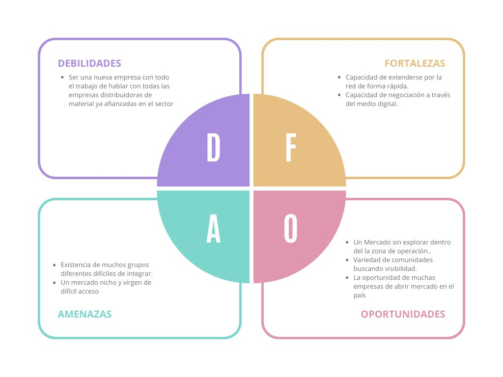

# Anteproxecto fin de ciclo

- [Anteproxecto fin de ciclo](#anteproxecto-fin-de-ciclo)
  - [1- Descrición do proxecto](#1--descrición-do-proxecto)
  - [2- Empresa](#2--empresa)
    - [2.1- Idea de negocio](#21--idea-de-negocio)
    - [2.2- Xustificación da idea](#22--xustificación-da-idea)
    - [2.3- Segmento de clientes](#23--segmento-de-clientes)
    - [2.4- Competencia](#24--competencia)
    - [2.5- Proposta de valor](#25--proposta-de-valor)
    - [2.6- Forma xurídica](#26--forma-xurídica)
    - [2.7- Investimentos](#27--investimentos)
      - [2.7.1- Custos](#271--custos)
      - [2.7.2- Ingresos](#272--ingresos)
    - [2.8- Viabilidade](#28--viabilidade)
      - [2.8.1- Viabilidade técnica](#281--viabilidade-técnica)
      - [2.8.2 - Viabilidade económica](#282---viabilidade-económica)
      - [2.8.3- Conclusión](#283--conclusión)
  - [3- Requirimentos técnicos](#3--requirimentos-técnicos)
  - [4- Planificación](#4--planificación)

## 1- Descrición do proxecto

Con este proyecto se busca la creación de una página y api que sirvan como nexo para las comunidades de rol en España, con la posibilidad de aumentar nuestras fronteras a futuro, intentando llegar a más distancia. Añadido a esto, tambien buscamos crear un mercado donde ofrecer servicios y productos sobre el mundo del rol.
Dada la planificación de un marketplace, donde imprentas puedan anunciar sus productos para entusiastas del rol de todo el país, intentando incluir a los negocios más pequeños en nuestra comunidad.

La idea abre a muchos caminos financieros, ya no solo desde la comisión a empresas por ofrecer y vender sus productos en nuestra web, además de tramitar sus pedidos directamente, facilitandoles la tarea. Tambien contamos con comunidades que aunque en menor medida puedan ayudar a crecer a la plataforma, ayudando no solo de forma económica si no tambien en forma de atención y visibilidad.

Además para realizar la tarea usaremos tecnologías comunes como HTML5 ,CSS3, seguramente con apoyo de SaSS para su desarroyo frontal y diseño externo. La parte intera usara un servior node usando expresiones jquery dinámicas para construir la estructura del sistema interno de la página, debido al funcionamiento como mercado de la misma deberemos incluir tambien una implementación con una api que lleve los pedidos, para ellos usaremos una Api de ecomerce, cambiada para llevar los productos con mayor facilidad usando python o C. Por último cabe destacar la existencia de una base de datos que lleva la informacion de los usuarios y las empresas y productos escrita en Mysql. Debido a la estructura como comunidad de la página tambien nos gustaría usar WebRTC para crear un chat en tiempo real (inicialmente de texto) para los usuarios y comunidades de nuestra página.

Como finalización, nos gustaría tambien preparar la página para aceptar un VTT con el que poder llevar partidas de rol, aunque ese ya sería un proyecto a futuro para nuestra página.

## 2- Empresa

### 2.1- Idea de negocio

El producto central que ofrecemos es una alternativa a las comunidades de rol hispano hablantes, ofreciendoles un mercado centralizado en el rol en español y ayudando a la gente a encontrar un entorno amigable y saludable en donde jugar.

Gracias a esto ofrecemos un lugar donde empresas pueden ofertar sus productos, con menor costo que en una tienda física, además de facilitar el trámite de los mismos. Aparte de eso tambien ofrecemos un lugar donde, a la larga, poder no solo quedar, si no tambien jugar partidas de rol.

Nos gustaría tambien servir como plataforma para negocios pequeños y locales que quieran aumentar sus miras para el resto de la comunidad.

### 2.2- Xustificación da idea

Desde un punto de vista relativo, comparandola con otros sectores, el sector de jugadores de rol no encajan demasiado en ningun otro perfil, se podría comparar con los jugadores de video juegos, pero dentro de estos los jugadores de juegos de Rol tabletop son una pequeña comunidad en comparación. Lo mismo pasa con los jugadores de juegos de mesa, los cuales cada vez se acercan más a juegos de rol.

La comunidad de jugadores de juegos de rol se encuentra, sobre todo en este país, centrada en comunidades online, estas comunidades muestran un tiempo de vida corto devido a la poca unificación del sector. Este es un problema que buscamos solucionar expandiendo las capacidades de conectar con nuestra web y aplicación.

Además para estos jugadores el mercado esta centralizado fuera de nuestro pais, buscamos tambien por tanto facilitar el acceso a este mercado a empresas locales, de media a gran escala.

En el ambito español, no existe una comunidad de rol que pueda unir a todo el resto, lo más parecido como plataforma que existe es la aplicación y web Americana [Roll20](https://roll20.net/), esta plataforma esta muy globalizada, dando el problema de no ser capaz de unir a los negocios y grupos más pequeños. Otras empresas desarroyan VTTs donde jugar pero no sirven como comunidades para la tarea, como por ejemplo [Foundry](https://foundryvtt.com/).

Fuentes: 
- [Informacion sobre los juegos de mesa y su extensión](https://www.gminsights.com/es/industry-analysis/board-games-market)
- [Informacion sobre el sector de los videojuegos en EEUU 2024](https://es.statista.com/estadisticas/1322035/generos-de-videojuegos-favoritos-en-ee-uu/)

### 2.3- Segmento de clientes

Durante todo este tiempo hablamos de los usuarios de las diferentes comunidades de rol, ellos serían nuestros clientes, pero no serían nuestra fuente de ingresos principales. Lo que buscamos es hacer una comunidad de rol donde la gente pueda jugar, los beneficios vendrían desde todas las empresas de juegos de mesa tabletop (Wizards of the Coast, Paizo...) que pueden ofrecer sus servicios y productos en nuestra web. 

A cambio de facilitar la visibilidad de estas empresas, y otros negocios, buscamos el beneficio a traves de ofrecer nuestros servicios a este sector.

Las empresas de productos de rol serian por tanto nuestra fuente de beneficioes, a ellas se les cobraría una comision sobre sus productos vendidos en la página, aparte de una entrada de visibilidad en la misma. Además tambien buscariamos con la posterior creación del VTT la posibilidad de mostrar sus productos y adpatarlos a nuestro sistema, intentando expandir su clientela.

### 2.4- Competencia

> _EXPLICACIÓN_: Neste apartado deberase indicar que outras empresas operan no mercado. Que cota de mercado teñen e como están posicionadas. Existencia de productos/servizos substitutivos. Como están posicionados.

### 2.5- Proposta de valor

> _EXPLICACIÓN_: **Apartado fundamental.**
>
> - En que se diferencia fronte os competidores.
> - Que melloras terá fronte os competidores.
> - Que valor aporta ao mercado.
> - ¿Porqué mercarán/contratarán este producto/servizo/idea fronte o resto?

### 2.6- Forma xurídica

> _EXPLICACIÓN_: Neste apartado deberedes indicar a forma xurídica: autónomo, soc. Cooperativa, SL,.. Explicando (nun par de frases) por que escolledes esta forma

### 2.7- Investimentos

> _EXPLICACIÓN_: Neste apartado idicaremos o investimentos, aínda que sexa, só unha enumeración de todo o que necesitan (locais, infraestruturas, equipos, suministros, mobiliario...) cuantificando cada elemento.

#### 2.7.1- Custos

> > _EXPLICACIÓN_: Neste apartado idicaremos o invertimento
>
> - Diferenzando custos fixos de variables.
> - Computando impostos e custos sociais.

#### 2.7.2- Ingresos

> _EXPLICACIÓN_: Neste apartado indicarase unha previsión de ventas e unha política de prezos. Isto implicar apuntar unha previsión de ventas e unha política de prezos.

### 2.8- Viabilidade

#### 2.8.1- Viabilidade técnica

> _EXPLICACIÓN_: Neste subapartado deberás defender tendo en conta os datos xa aportados, a viabilidade da realización do proyecto.
> Evidentemente, para poder xustificar a viabilidade económica do proyecto deberás ter en conta os ingresos. **Ainda que está na parte de empresa, este apartado é interesante dende o punto de vista técnico**
>
> - Será posible dispoñer dos recursos humanos e medios de produción necesarios (materias primas, maquinaria, instalacións, etc.)?
> - Existe algún impedimento técnico que dificulte o proceso produtivo?

#### 2.8.2 - Viabilidade económica

> _EXPLICACIÓN_: Neste subapartado deberás defender con datos a viabilidade da realización do proyecto, para elo debes indicar os custos e investimentos:

#### 2.8.3- Conclusión

> - É viable?
> - Os beneficios do proxecto son superiores aos costes?
> - As perdas poden cubrirse vía financiamento (por parte da administración pública, con subvencións, etc)?

## 3- Requirimentos técnicos

- **Infraestructura:** Pensabamos pedir desde nuestra empresa un nombre de dominio web acorde con nuestra actividad, además tambien barajamos la adquisición de una equipo servidor que nos sirva como puente para nuestra programacion a nivel servidor. Este equipo consta de memoria SSD 500GB, 16 Gb RAM DDR.4 y procesador AMD Ryzen™ 7 5825U.

- **Backend:** Se usara Jquery con un servidor node para la parte dinámica de la página, Mysql a la hora de llevar la base de datos, y como puente entre las diferentes APis, lo uniremos al servidor con C o Python (Esperando a ver las dependencias de cada lenguaje). Se usara tambien una API a eleccion para las ventas (Global.shop o prestashop).

- **Frontend:** Usaremos HTML5, css3 Diseñado con SaSS, y una estructura js creada con Node. Además usaremos una librearía para comunicaciones WebRTC.

## 4- Planificación

[Acceso al diagrama de Grantt del proyecto (PDF)](utils/Diagrama%20de%20Gantt%20-%20Diagrama%20de%20Gantt.pdf)

[Acceso al diagrama de Grantt del proyecto (Exceel)](utils/Diagrama%20de%20Gantt.xlsx)

[**<-Anterior**](../../README.md)